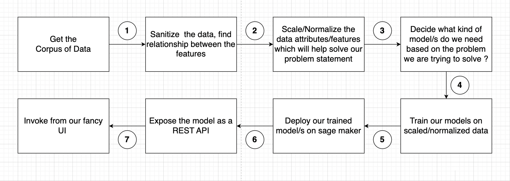
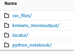

# recommendation-engine-full-stack


## Diagrammatic flow of our process



#1) Login as Admin to the AWS Account in which the setup will be done.<br/>
#2) Open Cloud9. Choose a t3.small machine, connectivity via SSM. <br/>
#3) Let's download the code now  
<code>git clone https://github.com/pkamra/recommendation-engine-full-stack.git <br/>
    sudo yum install git-lfs<br/>
    cd recommendation-engine-full-stack<br/>
    git lfs fetch origin main<br/>
    git lfs pull origin<br/>
</code>

#4) Decompress the zip file representing our raw data as follows
-  cd data
-  jar xvf csv_files.zip 

#5) Some cleanup inside the data folder before we upload it to s3.
-  rm -rf __MACOSX/ csv_files.zip 

This is how my cleaned data folder looks now
- Admin:~/environment/recommendation-engine-full-stack/data (main) $ ls -la
- drwxrwxr-x 2 ec2-user ec2-user  55 Apr  7 20:10 csv_files
- drwxrwxr-x 3 ec2-user ec2-user  68 Apr  7 21:54 kmeans_movieoutput
- drwxrwxr-x 2 ec2-user ec2-user  25 Apr  7 21:54 localui
- drwxrwxr-x 2 ec2-user ec2-user  90 Apr  7 21:54 python_notebook


#6) Upload the raw data to s3, so that it can be used by our sagemaker notebook environment. Before executing the below command create a bucket in s3.
- Admin:~/environment/recommendation-engine-full-stack/data $ `aws s3 cp --recursive . s3://awesome2023-XXXXX/`

#7)On upload to S3 this is how it looks 
- 

#8)Now we will get ready to start exploring our data in Sagemaker Studio environment.
- On AWS Console select Amazon Sagemaker. 
- Click on Create a Sagemaker domain. In  my case I set my domain name as awesome2023-recommendation.
- Choose the default user profile. Choose "Create an IAM Role" for permissions associated with the User Profile. In the popup choose appropriate s3 buckets. 
- Note down the name of the newly created Role. In my case it started with AmazonSageMaker-ExecutionRole-xxxxxx (781)

#9)The creation of the new domain will take a few minutes.
<Creation of the new domain takes about 5 minutes>

#10)Go to user profiles and click on launch->Studio (takes about 4 minutes)

#11)Once the Sagemaker Studio opens, 
- Go to File -> New Terminal
- Execute the following on the terminal 
- `aws s3 cp s3://awesome2023-xxxxx/python_notebook/AWSWomenInEngineering2023_V2.ipynb .`

#12) Double clicking the Jupyter Notebook will start the kernel. This process takes about 5 mins.


#13) Since the sklearn model is not a native sagemaker endpoint , but rather a  custom model being deployed in the sagemaker environment we will use the the sagemaker migration toolkit for deployment of the sklearn model as an endpoint in the Sagemaker environment. 
-  Open the Cloud9 environment , go to the folder sagemaker-migration-toolkit. Here are the high level steps. Detailed steps are mentioned in sagemaker-migration-toolkit/README.md
     - `pip install wheel`
     - `python setup.py bdist_wheel`
     - `pip install dist/sagemaker_migration_toolkit-0.0.1-py3-none-any.whl`
     - Go to IAM and find the IAM role for Sagemaker which will allow creating SageMaker Models, Endpoint Configurations, and Endpoints. It is best practice to create a role with the least priviledges needed. For quick start I used the Amazon managed Sagemaker execution role that I used earlier when I set up my Sagemaker domain which was of this kind of format `arn:aws:iam::<ACCOUNT>:role/service-role/AmazonSageMaker-ExecutionRole-XXXXXXX`
     - Execute this command `sagemaker_migration-configure --module-name sagemaker_migration.configure` and follow steps to enter the arn of the above role when asked.
     - Go to testing/sklearn folder 
     - Download the model.joblib from sagemaker notebook and upload it to your Cloud9 Console in testing/sklearn folder or download the model from yoru s3 bucket where you saved the model while executing the Jupyter Notebook in the steps above. I downlaoded from the s3 bucket as follows `aws s3 cp s3://awesome2023-XXXXXXXX/model.joblib ./`
     - Inside the testing/sklearn folder , execute `python test.py` . This will deploy the sagemaker endpoint for sklearn.
     - Once the endpoint is deployed , go to the AWS Sagemaker console and go to Inference-> Endpoints  and take down the name of the deployed endpoint. 
     - Copy the sed command from inside of DEPLOY_INSTRUCTIONS.md , replace the name of sagemaker endpoint and execute the script on the command prompt in cloud 9. `sed -i s@SAGEMAKER-ENDPOINT@xx-xx-xx-xxxx-xx-xx-xx-xx-xx@g localtest.sh`
     - Execute the following to test `sh localtest.sh`
     - Check if you have got scaled responses in prediction_response.json

#14) We will be saving the clustered final data for quick retrieval puposes, so lets go back to Glue and create the `default` database before continuing to execute further cells in the Jupyter notebook. 


#15) After all cells remaining are executed, let us create the API's using an open source tool called chalice which makes the creation of Lambda and API gateway very easy.
- Lets open a brand new Cloud 9 environment 
- Purpose of this API is to take in categories that you are interested in and then call the 2 sagemaker endpoints behind the scenes and return a cluster number

#16) On the New Cloud 9 Instance do the following
- `git clone https://github.com/pkamra/recommendation-engine-full-stack.git`
- `pip install chalice`
- `chalice new-project sagemaker-apigateway-lambda-chalice`
- To see hidden files in Cloud9 IDE , click on the gear icon and Click on Show environment root and show hidden files
- Then in the .chalice folder config.json file, add "automatic_layer": true, add requirements.txt and app.py contents to the root of the project from the chalice_custom_scaling_kmeans_api folder. 
- export AWS_DEFAULT_REGION=us-east-1
- Create a role Cloud9_LambdaExecutionRole with the right access policies. This role is added as the lambda execution role in config.json inside the .chalice folder
- `chalice deploy`
- curl -X POST https://xxxxxx.execute-api.us-east-1.amazonaws.com/api -H 'Content-Type: application/json' -d @- <<BODY
{
    "startYear":"2015","runtimeMinutes":"100","Thriller":"1","Music":"0",
    "Documentary":"0","Film-Noir":"0","War":"0","History":"0","Animation":"0",
    "Biography":"0","Horror":"0","Adventure":"1","Sport":"0","News":"0","Musical":"0",
    "Mystery":"0","Action":"1","Comedy":"0","Sci-Fi":"1","Crime":"1","Romance":"0",
    "Fantasy":"0","Western":"0","Drama":"0","Family":"0","averageRating":"7","numVotes":"50"
}
BODY 

#17) Test with Postman (Optional)
Post payload is 
{"startYear":"2015","runtimeMinutes":"100","Thriller":"1","Music":"0","Documentary":"0","Film-Noir":"0","War":"0","History":"0","Animation":"0","Biography":"0","Horror":"0","Adventure":"1","Sport":"0","News":"0","Musical":"0","Mystery":"0","Action":"1","Comedy":"0","Sci-Fi":"1","Crime":"1","Romance":"0","Fantasy":"0","Western":"0","Drama":"0","Family":"0","averageRating":"7","numVotes":"50"
}

#18) Execute `chalice new-project query-athena-boto3`
   - add requirements.txt and app.py contents to the root of the project from the chalice_query_api folder.  
   - Update role in config.json for this project
   - create query_results folder in the S3 bucket
   - sed -i s@BUCKET_NAME@<your bucket name>@g app.py
   - Execute `chalice deploy`
   - curl command for testing 
    ``` curl -X POST https://xxxxxxx.execute-api.us-east-1.amazonaws.com/api \
   -H 'Content-Type: application/json' \
   -d '{"cluster":"1.0"}'   ```


#19) Download the html file locally , modify the cluster and recommendation url api's with the actual API urls and see the end result from the UI.


#20) Cleanup steps
- Shut down Sagemaker studio environment
- Inside the chalice projects perform`chalice delete` 
- Delete the Cloud 9 environments 
- Delete the deployed sagemaker endpoints 


